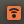

## Graphic Interface Option

   **A seguir será mostrados as configurações necessárias via interface gráfica do Ubuntu pra isso tudo dar certo**

   a) Discovering the:
   ```
   ifconfig
   ```

   b) Configuraçẽos wifi:

   ```
   nm-connection-editor 

   ```
   Vai abrir uma interface gráfica.
   * Abrir IPV4Settings
   >> Colocar o "Method" como `Shared to other computers`
   
   >>Criar um endereço "Adress" no seguinte formato:
   NN.NN.N.K onde N são os primeiros digitos do IP do drone e K é um digito que vc quiser diferente do ultimo digito do IP do drone.

   >> Configurar o Netmask igual ao do drone.
   (Se vc der o comando do passo a) vc vai ver o netmask ao lado do IP. Não esqueça de dar "Save".
   

   d) Ligando tudo pelo terminal 

   ```
   ssh [nome_do_pc_que_deseja_conectar]@[IP]
   #Exemplo
   ssh skyrats@10.42.0.1
   ```
   Se der certo esse será o icone wifi que vai aparecer pra vc.

   